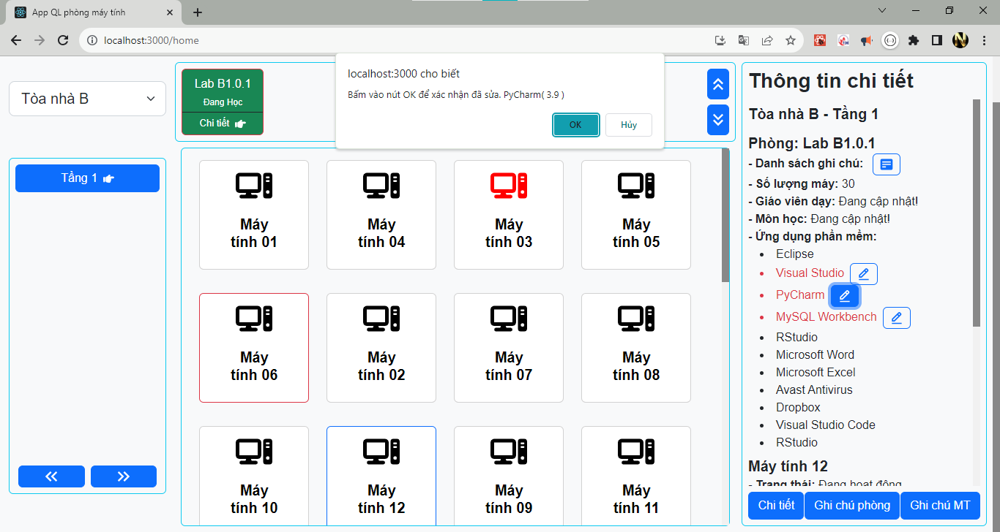
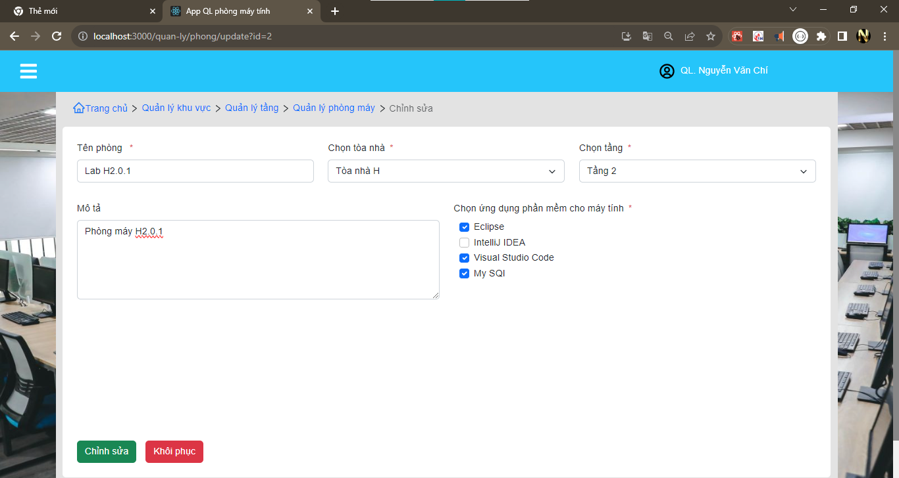
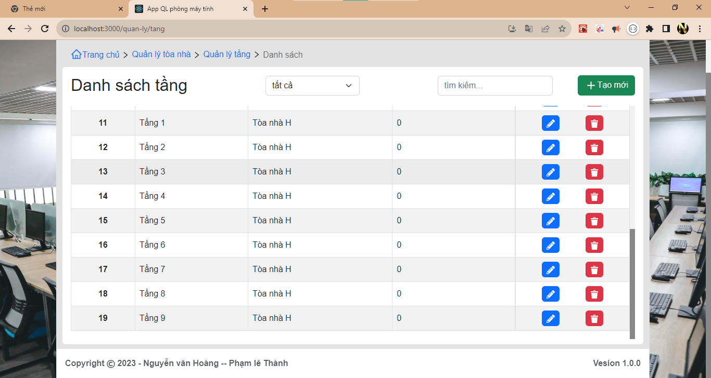
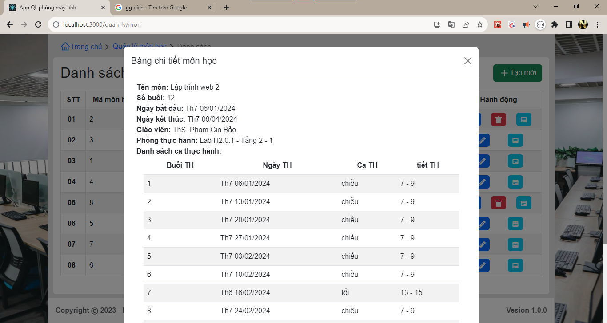
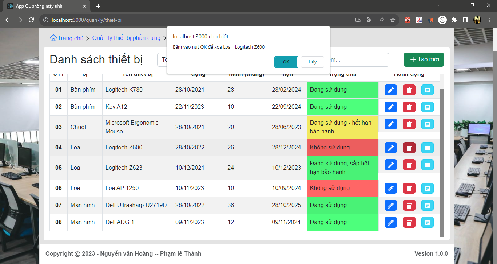
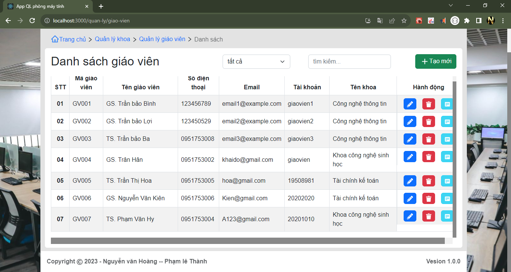
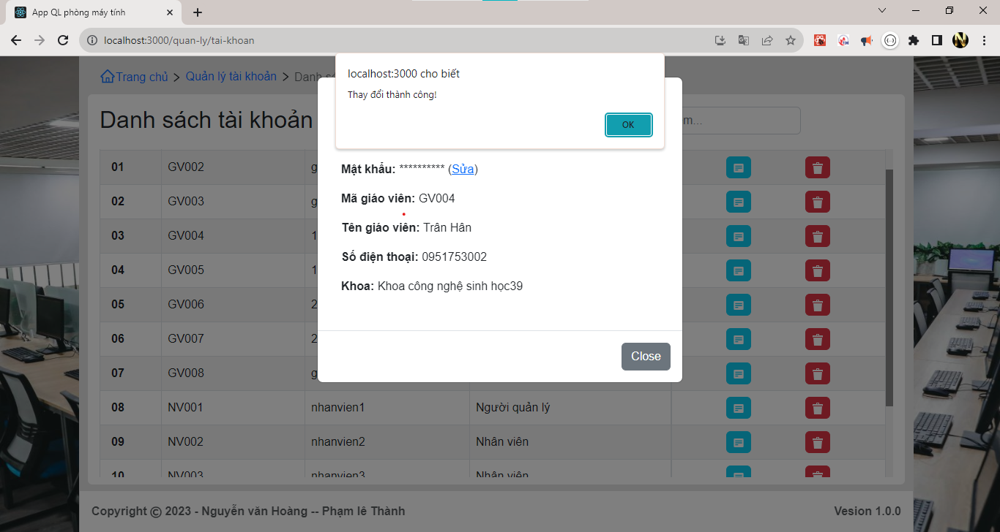
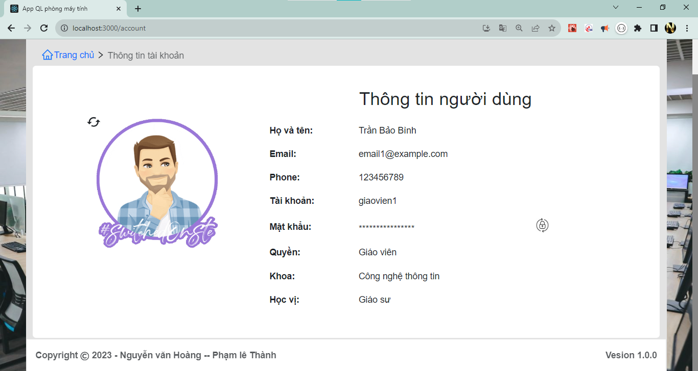
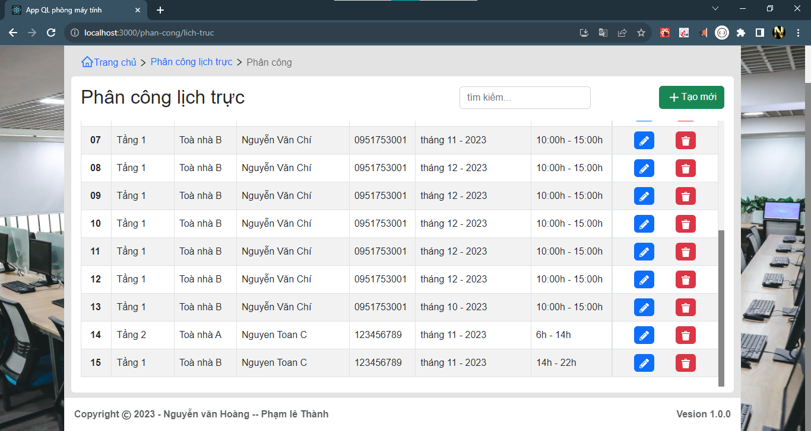
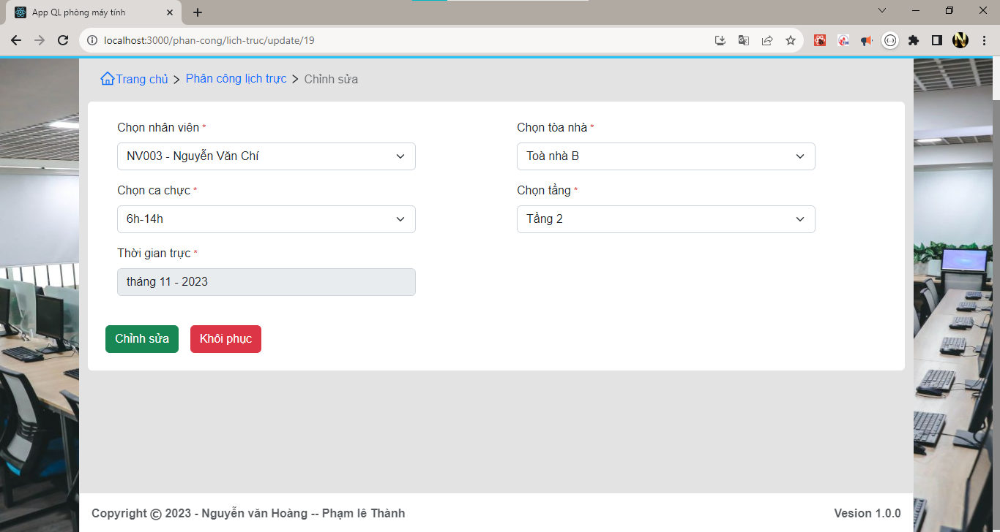

# App Quản lý thiết bị phần mềm cho phòng máy tính DHCN

## ảnh minh họa

### Page Brand

### ảnh quản lý phòng

### ảnh quản lý khu vực

### ảnh quản lý tầng

### ảnh quản lý môn học

### ảnh quản lý Thiết bị

### ảnh quản lý Nhân viên

### ảnh quản lý Khoa

### ảnh quản lý Giáo viên

### ảnh quản lý tai khoan

### ảnh Login

### Ảnh Page Profile 

### ảnh lich Truc

## Note
    - cần sửa lại tabbar link chưa phù hợp - 90%
    - can tang khoang cach giua component - z (dang ep cứng khoang cach)
    - can lay va chuyen data qu cac man hinh - z
    - overFlow -z 
    - FormAddPhong - chua bat su kien cua checkbox - z
    - thêm phong phải them dược cac so may - so thiet bị - so phan mem -z
    - chưa sử lý tgian hết hạn sử dụng của Tbi - PM (dang them +1 vao thang) - y
    - ModalChangePass: gui data redux -- Call Api - z

    - tìm kiếm -  detailKhuVuc chưa có gì
    - PageQLPhongMay - can 1 search theo status
    - Đăng nhập thêm checkbox - Đăng nhập với quyền quản lý 
    - FormAddPhong - Formupdate- can checkbox ALL
    - PageQLPhongMay - chua co sk  btn update - detail
    - PageQLPhongMay - chua co ai quan ly o do
    - PageQLPhanMem - chuc nang CRUD chua co gi
    - PageQlMonHoc: Chuc nang CRUD chua co
    - PageQlMonHoc can test lai cot trang thai
    - PageQLThietBi: Chuc nang CRUD chua co
    - PageQLNhanVien: Chuc nang CRUD chua co
    - PageQLKhoa: Chuc nang CRUD chua co
    - PageQLTaiKhoan: Chuc nang CRUD chua co
    - pageHome: phai the hien duoc dang o btn naof
    - pageHome: su dung phan trang de thay the cho over_flow_auto
    - pageHome: chua data api local
    - pageLogin: chua formik - api local
    - userReducer - getDangNhapApi() chua co cookie
    - userReducer - luu username vs token - chua luu token - xem quyen de gui di den trang cho GV || QL
    - pageLogin - dựa username lây thông tin nguoi dung
    - PageLichTruc: data api chua co - handleSearch chua co - select theo thang nam - update - del
    - FormAddLichTruc: del select Tgian truc
    - PageQlKhuVuc: Chua co CRUD vs APi
    -useLocation() : chuyển component A -> b kem theo giá tri

    
## error

