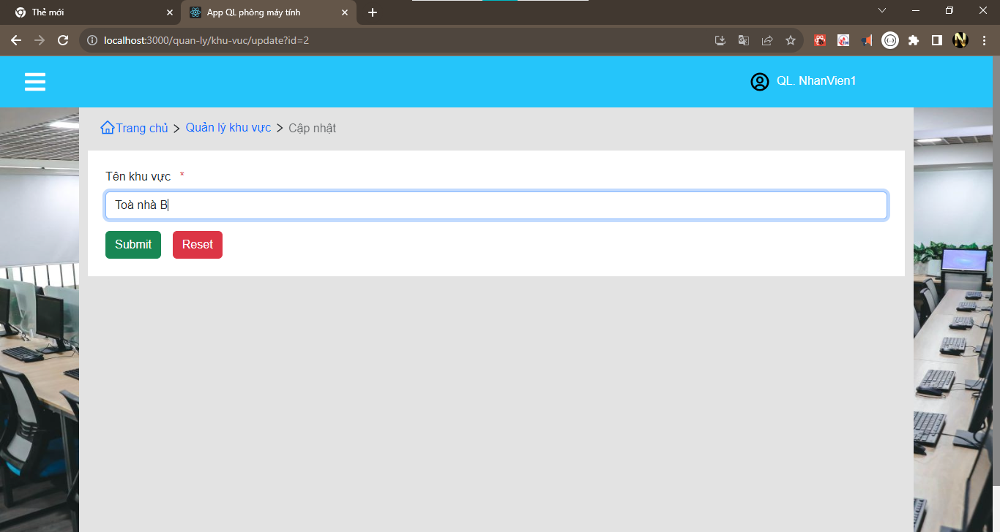
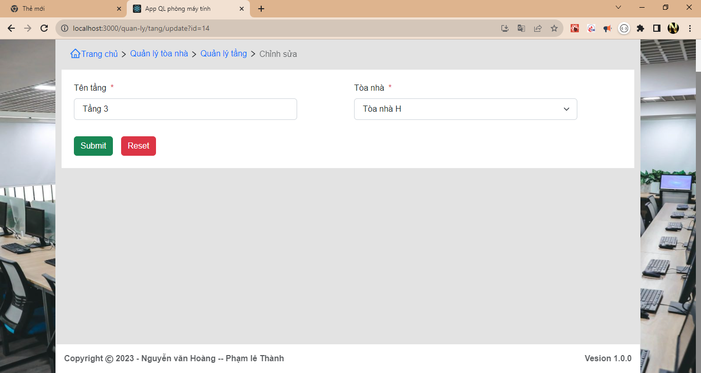
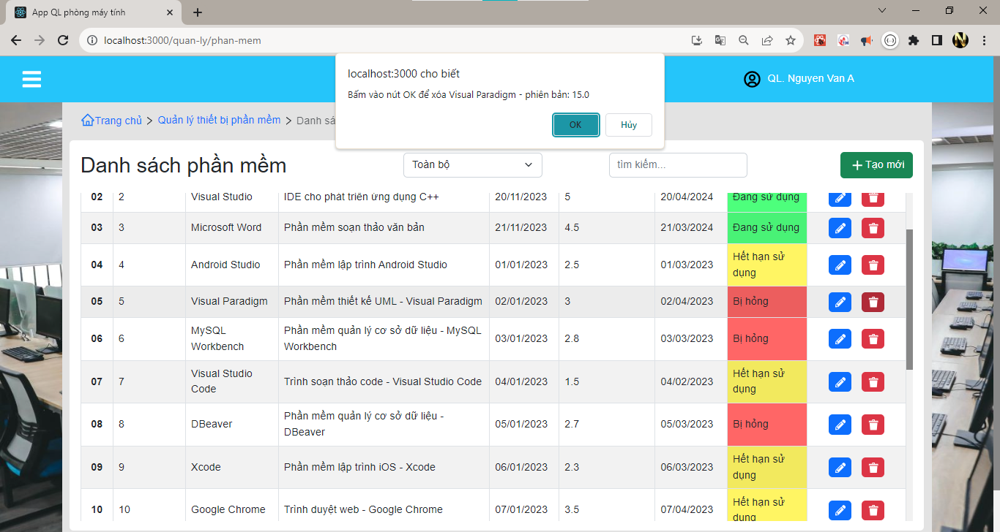
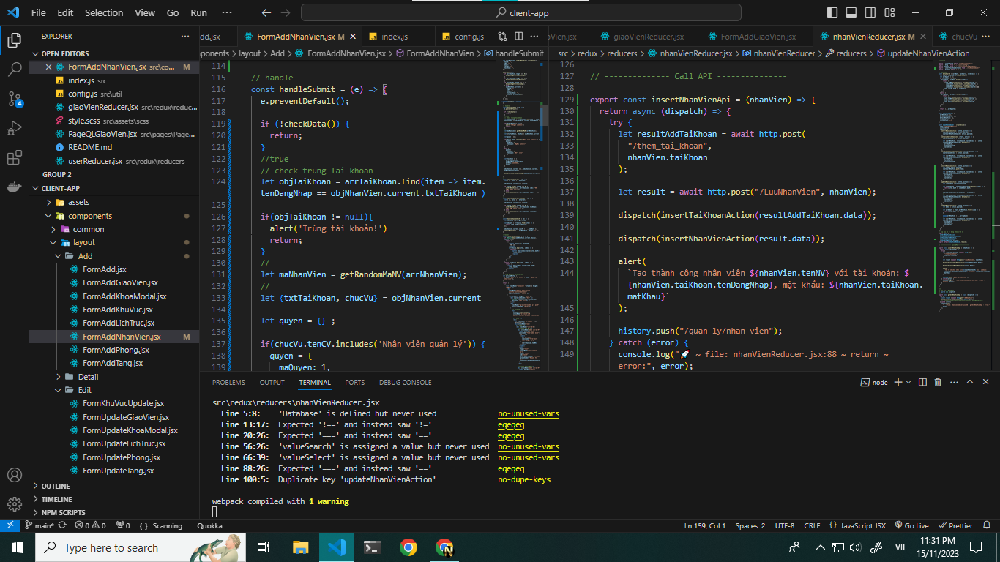
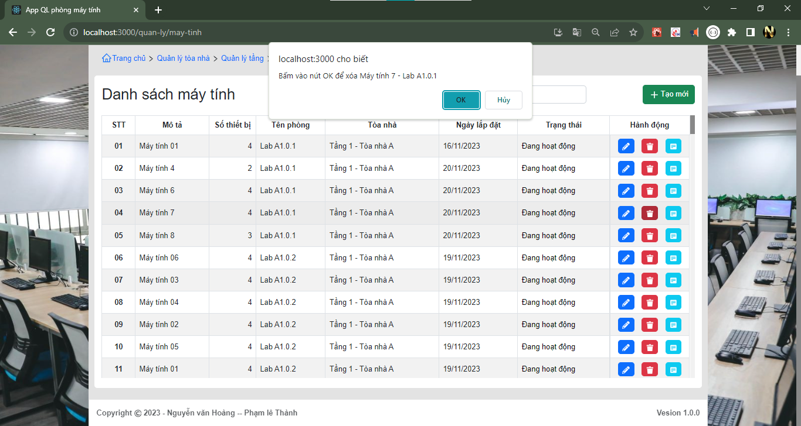
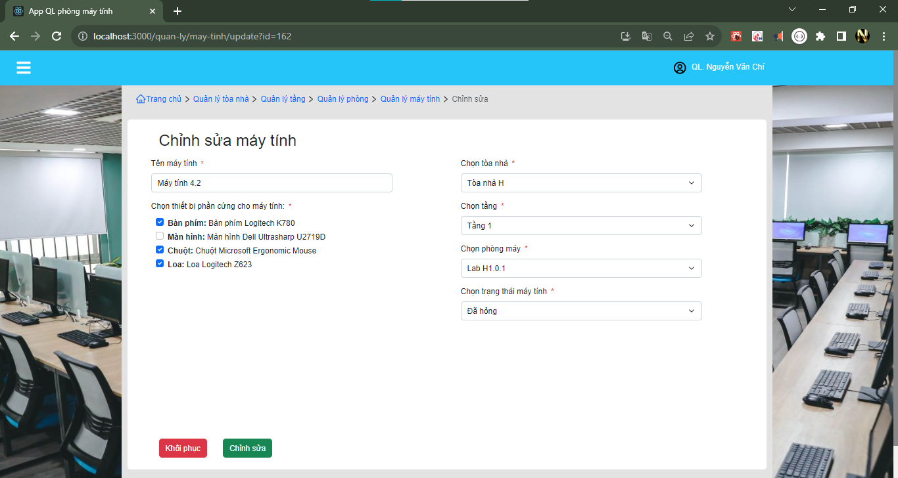
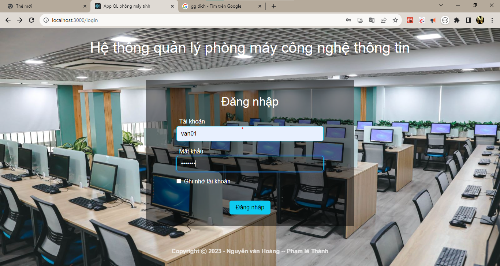
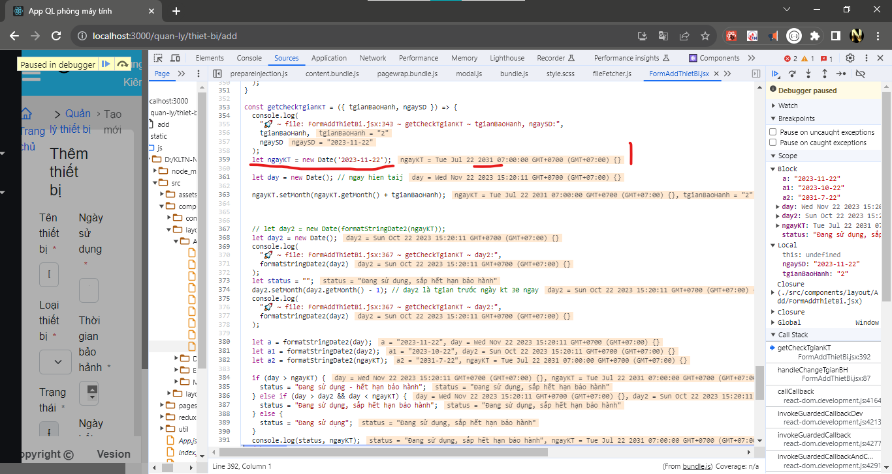

# App Quản lý thiết bị phần mềm cho phòng máy tính DHCN

## ảnh minh họa

### Page Brand

### ảnh quản lý phòng

### ảnh quản lý khu vực

### ảnh quản lý tầng

### ảnh quản lý môn học

### ảnh quản lý Thiết bị

### ảnh quản lý Phần mềm

### ảnh quản lý Nhân viên

### ảnh quản lý Khoa

### ảnh quản lý Giáo viên

### ảnh quản lý tai khoan

### ảnh quản lý mayTinh

### ảnh Login

### Ảnh Page Profile 

### ảnh lich Truc

## note del
* load lai data trang home
    - dispatch(setStatusDataMoi(true))

## Note
    - cần sửa lại tabbar link chưa phù hợp - 90%
    - can tang khoang cach giua component - z (dang ep cứng khoang cach)
    - can lay va chuyen data qu cac man hinh - z
    - overFlow -z 
    - FormAddPhong - chua bat su kien cua checkbox - z
    - thêm phong phải them dược cac so may - so thiet bị - so phan mem -z
    - chưa sử lý tgian hết hạn sử dụng của Tbi - PM (dang them +1 vao thang) - y
    - ModalChangePass: gui data redux -- Call Api - z
    - FormAddPhong: chua co check data co ToaNha vs tang - z
    - FormAddGiaoVien: api add TaiKhoan Thanh cong -- api Add GV errr 500 -- update theeo server mới thử- good look = z (fix them tai khoan trong api insert cua GV)

    - tìm kiếm -  detailKhuVuc chưa có gì
    - PageQLPhongMay - can 1 search theo status
    - Đăng nhập thêm checkbox - Đăng nhập với quyền quản lý 
    - FormAddPhong - Formupdate- can checkbox ALL
    - PageQLPhongMay - chua co sk  btn update - detail
    - PageQLPhongMay - chua co ai quan ly o do
    - PageQLPhanMem - chuc nang CRUD chua co gi
    - PageQlMonHoc: Chuc nang CRUD chua co
    - PageQlMonHoc can test lai cot trang thai
    - PageQLThietBi: Chuc nang CRUD chua co
    - PageQLNhanVien: Chuc nang CRUD chua co
    - PageQLKhoa: Chuc nang CRUD chua co
    - PageQLTaiKhoan: Chuc nang CRUD chua co
    - pageHome: phai the hien duoc dang o btn naof
    - pageHome: su dung phan trang de thay the cho over_flow_auto
    - pageHome: chua data api local
    - pageLogin: chua formik - api local
    - userReducer - getDangNhapApi() chua co cookie
    - userReducer - luu username vs token - chua luu token - xem quyen de gui di den trang cho GV || QL
    - pageLogin - dựa username lây thông tin nguoi dung
    - PageLichTruc: data api chua co - handleSearch chua co - select theo thang nam - update - del
    - FormAddLichTruc: del select Tgian truc
    - PageQlKhuVuc: Chua co Update vs APi
    - useLocation() : chuyển component A -> b kem theo giá tri
    - QL Tang: chua co API update
    - QL phong may nen có người trực ở đó 
    - QL phong may tao co the tạo kèm theo may tính
    - QL Phong khi them 1 phong chon so luong máy tính(VD 5 cai) có thế mặc định add 5 cái may tinh không? 
    - FormAddPhong: api chua duoc
    - PageQLKhoa - update: chua biet tat model
    -- gans valueSearch vaf valueSelect
    - taiKhoanReducer: chua co api update
    --  error - select value: mối khi reset lại
    - PageQLNhanVien: xoa NV có lịch trực bị lỗi 500
    - PageLichTruc: xóa 1 lich truc cung bi lỗi 500
    - FormAddPhongMay: them moi  tung obj moi - add mayTinh - add phong - add phan mem vs Phong
    -- Add phong (tao phong - phanMem_Phong -mayTinh(co maPhong) - mayTinh_ThietBI)
    -- Page home: Cần hiên text red cho phòng may hay may tinh nào bị lỗi - chac cần 1 api co kèm theo status gì đó
    - mayTinhReducer: chua toi uu duoc dataSearch()
    - QLMayTInh: finhs GUi select Phong may -> gui len redux = >datasearch -> checkTH(test) -> select trang thai -> redux -> dataSearch => test  
    - Form add mayTinh -> subMit -> api - > update -> del
    - QLThietbi: "Chưa có api xoa thietbi ( xóa 1 thiet bị xóa cả MaytinhThietbij liên quan )
    - lichTrucReducer :có api server rồi - update di

    - ComponentModalGhiChu: err check box trùng value (mavalue) - lấy thông tin - xác nhận gửi
        + api thong báo - gửi ghi chú cùng thietbi bị lỗi  lưu data
        + btn sửa (bên cạnh textErr Thiet bị lỗi) hiên 1 modal chon cac tbi lỗi đã sủa xong cap nhật vao data;
        + chú ý cần cập nhật status ở mayTinhTHietbi và PhongMayPhanmem
        + thông báo: 
            - ma
            - noteGhi err
            - người ghi
            - tgian ghi
            - noteGhi sửa 
            - người Sửa
            - Tgian sửa

## Tài liệu

* useLocation() - [link](https://medium.com/@stheodorejohn/exploring-react-router-dom-understanding-the-uselocation-hook-f67742e71c0c)
* Lấy giá trị tham số từ chuối truy vấn? [link](https://www.javascripttutorial.net/es-next/javascript-object-fromentries/)

    
## error

### fix error
* Cannot add property 2, object is not extensible - structuredClone() ( [Link Fix](https://stackoverflow.com/questions/59648434/material-table-typeerror-cannot-add-property-tabledata-object-is-not-extensibl) )
    - một đối tượng có thể mở rộng và có thể thêm các thuộc tính mới vào nó. Tuy nhiên, trong trường hợp này, Object.preventExtensions()một đối tượng đã được đánh dấu là không thể mở rộng được nữa, do đó nó sẽ không bao giờ có các thuộc tính vượt quá những thuộc tính mà nó có tại thời điểm nó được đánh dấu là không thể mở rộng được.
