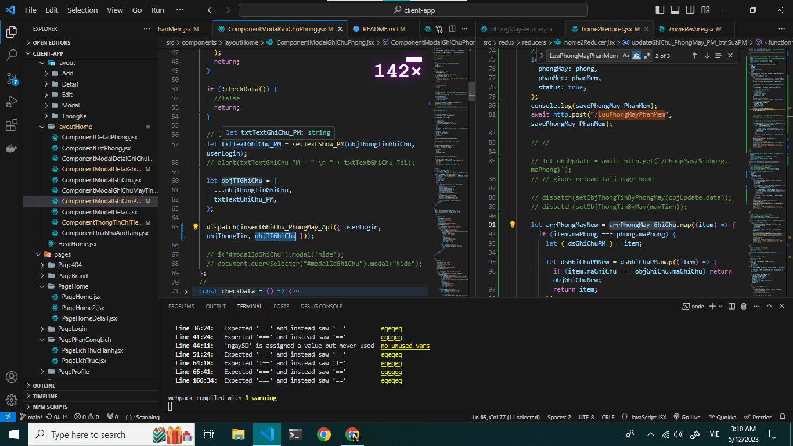

# App Quản lý thiết bị phần mềm cho phòng máy tính DHCN

## ảnh minh họa

### ảnh quản lý phòng

### ảnh quản khu vực

## Note
    - cần sửa lại tabbar link chưa phù hợp - 90%
    - can tang khoang cach giua component - z (dang ep cứng khoang cach)
    - can lay va chuyen data qu cac man hinh - z
    - overFlow -z 
    - FormAddPhong - chua bat su kien cua checkbox - z
    - thêm phong phải them dược cac so may - so thiet bị - so phan mem -z

    - tìm kiếm -  detailKhuVuc chưa có gì
    - PageQLPhongMay - can 1 search theo status
    - Đăng nhập thêm checkbox - Đăng nhập với quyền quản lý 
    - FormAddPhong - Formupdate- can checkbox ALL
    - PageQLPhongMay - chua co sk  btn update - detail
    - chưa sử lý tgian hết hạn sử dụng của Tbi - PM
